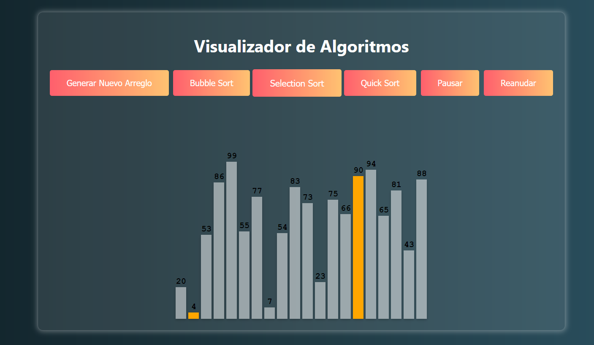

# Algo_visualizer

## Sorting Algorithms

### Bubble Sort

Bubble Sort is a simple sorting algorithm that repeatedly steps through the list, compares adjacent elements and swaps them if they are in the wrong order. The pass through the list is repeated until the list is sorted.

### Selection Sort

Selection Sort is a simple sorting algorithm that divides the input list into two parts: the sublist of items already sorted, which is built up from left to right at the front (left) of the list, and the sublist of items remaining to be sorted that occupy the rest of the list. The algorithm proceeds by finding the smallest (or largest, depending on sorting order) element in the unsorted sublist, swapping it with the leftmost unsorted element (putting it in sorted order), and moving the sublist boundaries one element to the right.

### Quick Sort

Quick Sort is a divide-and-conquer algorithm. It works by selecting a 'pivot' element from the array and partitioning the other elements into two sub-arrays, according to whether they are less than or greater than the pivot. The sub-arrays are then recursively sorted.
